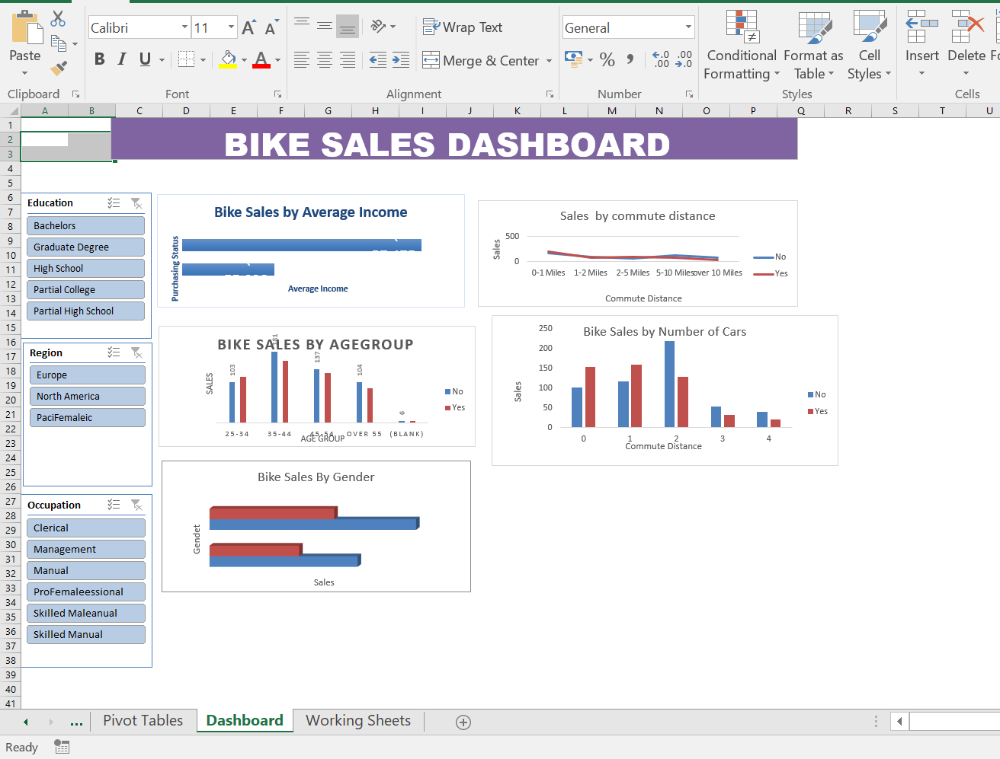

#
# Bike Sales Dashboard – Excel

A beginner-level Excel dashboard project that analyzes bike sales using PivotTables, PivotCharts, and interactive slicers.

## Project Preview

## Project Overview

This project is an interactive **Bike Sales Dashboard created in Microsoft Excel**.

The dashboard analyzes bike sales based on different customer characteristics such as **education, region, occupation, age group, gender, commute distance, and number of cars**.

The project is designed as a beginner-level data analysis project to practice **Excel PivotTables, PivotCharts, slicers, data analysis, and dashboard design**.

## From Data to Dashboard

The project started with a bike sales dataset containing customer and purchasing information.

The data was analyzed using Excel PivotTables and then converted into PivotCharts. Interactive slicers were added to allow users to filter the dashboard based on different customer categories.

The final dashboard brings the analysis together into a simple and interactive visual report.

### Source Data

The source dataset contains customer information and bike purchasing details.

### Dashboard

The final Excel dashboard contains multiple charts and slicers for exploring bike sales.

## Dashboard Features

- Interactive slicers for **Education**
- Interactive slicer for **Region**
- Interactive slicer for **Occupation**
- Bike sales analysis by **Average Income**
- Bike sales analysis by **Commute Distance**
- Bike sales analysis by **Age Group**
- Bike sales analysis by **Number of Cars**
- Bike sales analysis by **Gender**
- PivotTables for data analysis
- PivotCharts for data visualization
- Simple and beginner-friendly dashboard layout

## Key Analysis Areas

### Education
The dashboard allows users to filter bike sales based on different education levels, including:

- Bachelors
- Graduate Degree
- High School
- Partial College
- Partial High School

### Region
Bike sales can be explored across different regions:

- Europe
- North America
- Pacific

### Occupation
Users can filter the dashboard based on customer occupation, such as:

- Clerical
- Management
- Manual
- Professional
- Skilled Manual

### Customer Characteristics

The dashboard also provides visual analysis of bike sales based on:

- Age Group
- Gender
- Commute Distance
- Number of Cars
- Average Income

## Files Included

| File | Description |
|---|---|
| `BIKE-dashboard.xlsx` | Excel workbook containing the completed bike sales dashboard |
| `DASHBOARD.png` | Preview image of the Excel dashboard |
| `dataSet.png` | Preview of the source dataset |
| `README.md` | Project documentation |

> Replace the file names above if your actual GitHub file names are different.

## How to Download and Use

1. Download `BIKE-dashboard.xlsx` from this repository.
2. Open the workbook using **Microsoft Excel**.
3. Navigate to the **Dashboard** worksheet.
4. Use the available slicers to filter the data.
5. Explore the charts to understand bike sales across different customer characteristics.

[Download the Excel Dashboard](BIKE-dashboard.xlsx)

> The Excel workbook is recommended to be opened in Microsoft Excel because the dashboard uses PivotTables, PivotCharts, and slicers.

## Tools and Skills

- Microsoft Excel
- PivotTables
- PivotCharts
- Excel Slicers
- Data Analysis
- Data Visualization
- Dashboard Design
- Data Filtering
- Basic Excel Skills

## Project Level

**Beginner**

This project was created to practice fundamental Excel data analysis and dashboard-building skills using a real-world-style bike sales dataset.

## Learning Outcomes

Through this project, I practiced:

- Cleaning and organizing data
- Creating PivotTables
- Creating PivotCharts
- Using Excel slicers
- Analyzing customer data
- Creating interactive dashboards
- Presenting data using charts and visualizations
- Designing a simple Excel dashboard

## Conclusion

The Bike Sales Dashboard provides a simple way to explore bike purchasing patterns across different customer characteristics. This project demonstrates how Excel can be used to transform raw data into an interactive and easy-to-understand dashboard.
